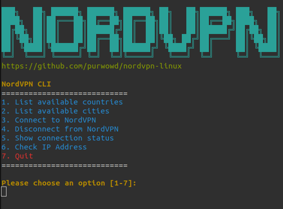

# NordVPNC CLI for Linux

## Description
A terminal-based tool for easily managing NordVPN connections. Features include:

- List countries and cities
- Connect/disconnect VPN
- Connection status
- Check IP address and country

## Prerequisites
- NordVPN account and **NordVPN CLI** installed

## License
Protected under [MIT License](LICENSE).